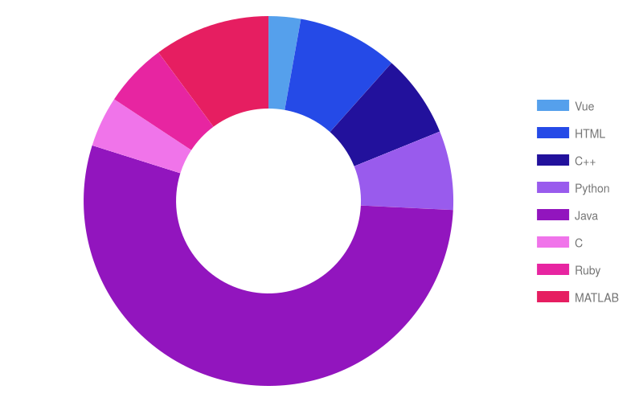
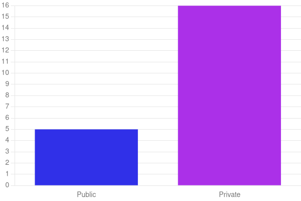

## Yo! 🙂

### Tools

  

### Profile Statistics

#### Programming languages 

#### Repository Distribution

<picture align="center">
  <source media="(prefers-color-scheme: dark)" srcset="https://raw.githubusercontent.com/KamillaRosa1/KamillaRosa1/output/github-contribution-grid-snake-dark.svg">
  <source media="(prefers-color-scheme: light)" srcset="https://raw.githubusercontent.com/KamillaRosa1/KamillaRosa1/output/github-contribution-grid-snake-dark.svg">
  
</picture>

<!--
**KamillaRosa1/KamillaRosa1** is a ✨ _special_ ✨ repository because its `README.md` (this file) appears on your GitHub profile.

Here are some ideas to get you started:

- 🔭 I’m currently working on ...
- 🌱 I’m currently learning ...
- 👯 I’m looking to collaborate on ...
- 🤔 I’m looking for help with ...
- 💬 Ask me about ...
- 📫 How to reach me: ...
- 😄 Pronouns: ...
- ⚡ Fun fact: ...
-->
